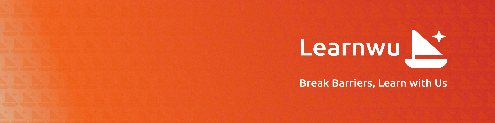

  

We’re building the next generation of online tutoring — **affordable, flexible, and human**.

Learnwu connects learners and tutors through thoughtful design and modern technology to make education more personal, effective, and accessible for everyone.

> _Built by engineers and educators who believe learning should feel empowering, not exhausting._

---

## 🚀 Vision

To make high-quality tutoring as accessible as streaming your favorite show — global, on-demand, and deeply human.

---

## 🧭 What We’re Working On

- 🧑‍🏫 Launching the Learnwu Tutor Marketplace (Building)
- 💬 Refining the in-lesson and feedback experience
- ⚙️ Expanding scheduling and learner-tutor matching

---

## 🤝 Connect

| Role           | Contact                                       |
| -------------- | --------------------------------------------- |
| Founder & Lead | [Phyo Thiha](mailto:phyothihacodes@gmail.com) |
| Website        | [learnwu.com](https://learnwu.com)            |
| GitHub         | [@learnwu](https://github.com/learnwu)        |

---

<b>Connecting curiosity with guidance.</b>

